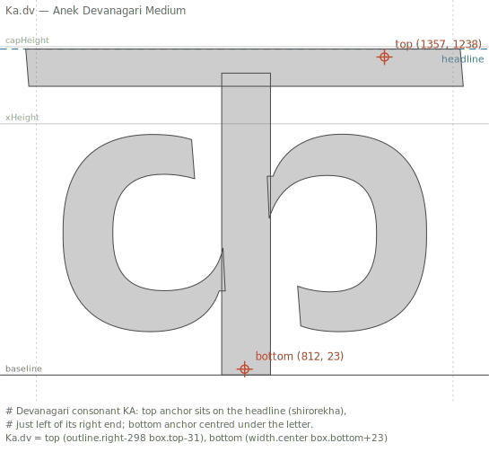

# AnchorsFactory user guide

A practical, illustrated guide to writing anchor rules. Where the
[rule-language spec](../anchor-rules.md) is the reference, this guide teaches
by example: every figure is produced by running the **real engine** on an
open-licensed font and rendering the anchors it placed (see
[Regenerating the figures](#regenerating-the-figures) below), so the pictures
can never drift from the implementation.

> **Status: skeleton.** The chapter list and abstracts are in place; the
> chapters themselves are stubs to be written.

## Chapters

1. [Getting started](01-getting-started.md) — install, run on a UFO, first rules file.
2. [Anchor placement basics](02-anchor-basics.md) — the `name (X Y)` form.
3. [X positions](03-x-positions.md) — `width`/`box`/`outline` frames, runs, `@` samples.
4. [Y positions](04-y-positions.md) — font metrics, `$Glyph`, own `box`/`outline`.
5. [Centroid](05-centroid.md) — the area centre of mass as an optical centre.
6. [Sums & biases](06-sums-and-biases.md) — combining terms with `+` / `-`.
7. [Variables & labels](07-variables-and-labels.md) — `&name` axis values, `@name` anchor sets.
8. [Selectors & the accumulation model](08-selectors-and-accumulation.md) — who a rule hits, and how `=`/`+=`/`-=` stack.
9. [Directives](09-directives.md) — `!extends`, `!suffixes`, `!shiftx`, `!propagate`.
10. [Italic behavior](10-italics.md) — automatic height-aware shear.
11. [Script cookbooks](11-script-cookbooks.md) — Latin, Cyrillic, Greek, Devanagari, Hebrew, Thai, Arabic notes.

## Proof of pipeline

The figure below is live output: a three-line `.anchors` rules file
([examples/deva-top-bottom.anchors](examples/deva-top-bottom.anchors)) applied by
`anchorsfactory` to the Devanagari consonant KA of
[Anek Devanagari](https://github.com/EkType/Anek) (OFL), then rendered with
the anchors and the headline guide annotated:



A second example does the same for a Thai consonant (KO KAI, Noto Sans Thai):
[examples/thai-top-bottom.svg](examples/thai-top-bottom.svg).

## Regenerating the figures

Figures are rendered by [tools/make_examples.py](tools/make_examples.py); the
fonts are fetched (shallow git clones of the OFL upstreams) by
[tools/fetch_fonts.sh](tools/fetch_fonts.sh) into the gitignored
`tools/_fonts/` cache. From the repo root:

```bash
docs/guide/tools/fetch_fonts.sh
FONTS=docs/guide/tools/_fonts

.venv/bin/python docs/guide/tools/make_examples.py rules \
    --font "$FONTS/Anek/sources/AnekDevanagari/Masters/AnekDevanagari-Medium.ufo" \
    --glyph Ka.dv --rules docs/guide/examples/deva-top-bottom.anchors \
    --hguide top:headline --fit ink -o docs/guide/examples/deva-top-bottom.svg

.venv/bin/python docs/guide/tools/make_examples.py rules \
    --font "$FONTS/thai/sources/NotoSansThai-Regular.ufo" \
    --glyph koKai-thai --rules docs/guide/examples/thai-top-bottom.anchors \
    --hguide xHeight:xHeight --fit ink -o docs/guide/examples/thai-top-bottom.svg
```

`make_examples.py` has two modes: `rules` (run a `.anchors` file through the engine
on an in-memory copy of the font and draw what it placed — nothing is saved
back) and `render` (draw explicitly given `--anchor name:x:y` points, for
didactic before/after figures). Run it with `--help` for the full options
(guides, captions, `--fit em|ink`, TTF input, …).
